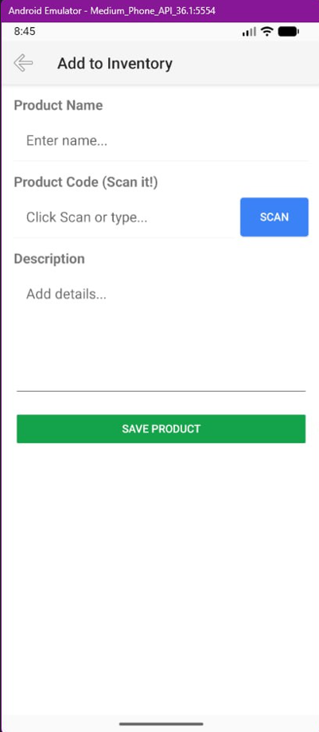
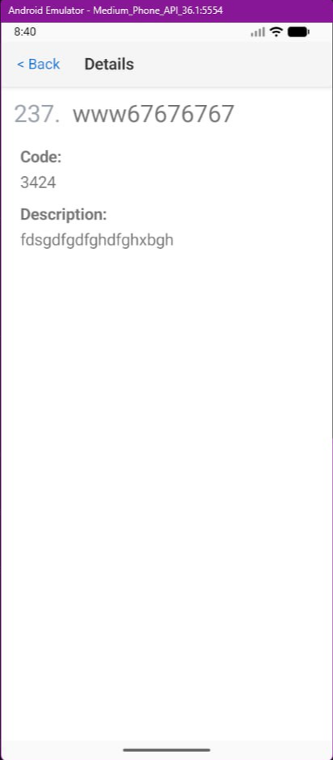

[](https://classroom.github.com/a/Uu9lUx8_)
[](https://classroom.github.com/online_ide?assignment_repo_id=22284751&assignment_repo_type=AssignmentRepo)
# NativeScript: Scan Inventory

## Cel
Zbuduj podstawową aplikację w **NativeScript używając framework Angular**, która używa **natywnej funkcji** oraz **komunikuje się z API**, z **3–4 widokami**.

## Opis projektu
Scan Inventory to mobilna aplikacja stworzona z wykorzystaniem NativeScript oraz frameworka Angular.  
Aplikacja umożliwia zarządzanie prostą listą produktów magazynowych, w tym przeglądanie listy produktów, wyświetlanie szczegółów wybranego produktu oraz dodawanie nowych pozycji.

Projekt został wykonany w ramach zadania zaliczeniowego i ma na celu zaprezentowanie:
- wykorzystania natywnych funkcji urządzenia mobilnego,
- komunikacji z zewnętrznym API REST,
- nawigacji pomiędzy wieloma widokami aplikacji.

---

## Wykorzystane technologie
- NativeScript
- Angular
- TypeScript
- Android SDK
- NativeScript Camera Plugin
- HttpClient (komunikacja z API REST)

---

## Widoki aplikacji
Aplikacja składa się z następujących widoków:
1. Lista produktów
   - wyświetlenie listy produktów,
   - prezentacja nazwy oraz kodu produktu.
2. Szczegóły produktu
   - wyświetlenie szczegółowych informacji o produkcie,
   - możliwość powrotu do listy produktów.
3. Dodaj produkt
   - formularz umożliwiający dodanie nowego produktu,
   - wykorzystanie natywnej funkcji aparatu.

---

## Funkcja natywna
W aplikacji wykorzystano aparat urządzenia mobilnego do wykonania zdjęcia produktu.  
Zastosowanie tej funkcji demonstruje integrację z natywnymi możliwościami systemu Android oraz obsługę uprawnień.

---

## Integracja z API
Aplikacja komunikuje się z zewnętrznym API REST przy użyciu protokołu HTTP:
- GET – pobieranie listy produktów,
- POST – dodawanie nowego produktu,
- DELETE – usuwanie produktu.

Podczas developmentu użyto przykładowego (mockowego) API.

---

## Walidacja formularzy
Zaimplementowano podstawową walidację formularzy:
- pola wymagane (nazwa produktu, kod produktu),
- prosta obsługa błędów.

---

## Zrzuty ekranu



---

## Uruchomienie projektu
```bash
npm install
ns run android
